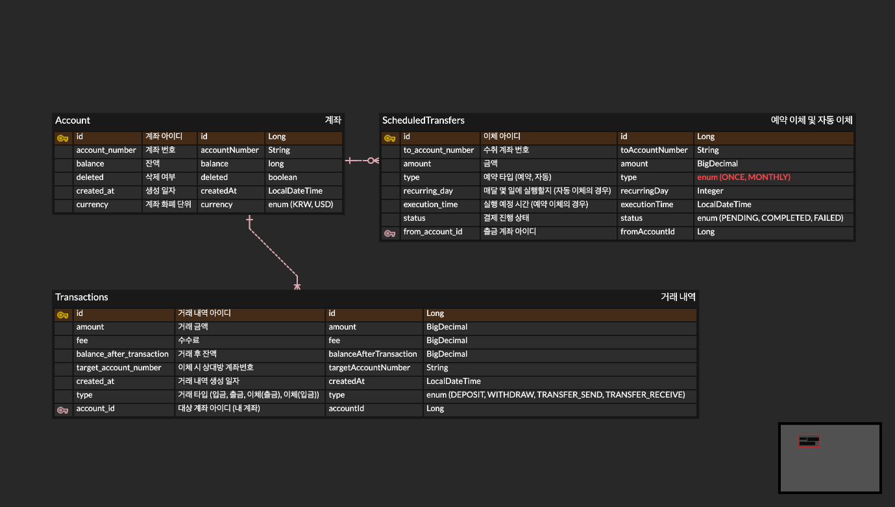

# 💰 Banking System

이 프로젝트는 객체 지향적인 설계와 도메인 주도 설계(DDD) 원칙을 적용하여 구축된 **온라인 뱅킹 시스템 API** 서비스입니다. 계좌 관리, 입출금 처리, 그리고 수수료 및 이체 한도 정책이 적용된 송금 기능을 제공합니다.



## 🚀 주요 기능

### 1. 계좌 관리 (Account)

* **계좌 등록**: 중복되지 않는 계좌 번호를 통해 새로운 계좌를 생성합니다.
* **계좌 삭제**: Soft Delete 방식을 사용하여 계좌 데이터를 안전하게 관리합니다.

### 2. 거래 관리 (Transaction)

* **입금 및 출금**: 실시간으로 계좌 잔액을 업데이트하며 거래 내역을 기록합니다.
* **계좌 이체**: 타 계좌로의 송금 기능을 제공합니다.
* **수수료 정책**: 모든 이체 시 금액의 **1% 수수료**가 발생합니다.
* **한도 정책**: 일일 출금 및 이체 한도를 체크하여 초과 시 거래를 제한합니다.

* **거래 내역 조회**: 특정 계좌의 모든 거래 기록을 페이징 처리하여 최신순으로 제공합니다.
### 3. 스케줄링 이체 (Scheduled Transfer) 🆕

* **예약 이체 (ONCE)**: 사용자가 지정한 특정 미래 시점에 1회성 이체를 실행합니다. 10분 단위로 설정 가능합니다.
* **자동 이체 (MONTHLY)**: 매달 지정된 날짜에 정기적으로 이체를 실행합니다.

* **자동 재등록**: 정기 이체 성공 시, 다음 달 이체 건을 자동으로 생성하여 연속성을 보장합니다.

### 4. 실시간 환율 조회 및 확장성 (Exchange Rate)
* **실시간 환율 정보 제공**: 외부 API를 연동하여 실시간 환율 정보를 조회하며, Redis 캐싱을 통해 응답 속도를 최적화했습니다.
* **해외 송금 확장 고려**: 단순 조회를 넘어 향후 해외 송금 기능(Remittance)으로의 확장을 고려하여 설계되었습니다.

## 🛠 기술적 특징

* **동시성 제어**: `Pessimistic Lock`(비관적 잠금)을 사용하여 동시에 발생하는 거래 상황에서 데이터 정합성을 보장합니다.
* **도메인 모델 중심**: `Money` Value Object 등을 활용하여 금액 계산의 정확성(`BigDecimal`)과 비즈니스 로직의 응집도를 높였습니다.
* **스케줄링 엔진**: Spring @Scheduled를 활용하여 10분 주기(예약) 및 매일 새벽 1시(정기) 프로세스를 운영합니다.

#### 클린 아키텍처 및 DIP(의존성 역전 원칙) 적용
* **외부 변경에 유연한 설계**: 인터페이스를 활용한 DIP(Dependency Inversion Principle)를 적용하여 외부의 변경이 내부 비즈니스 로직에 영향을 주지 않도록 격리했습니다.
* **테스트 용이성**: 인프라 세부 사항이 인터페이스에 의존하므로, 외부 서버 없이도 Mock 객체를 활용한 독립적인 단위 테스트 및 통합 테스트가 가능합니다.

#### 멀티 모듈 구조 (Multi-Module Project)
* 프로젝트를 역할에 따라 모듈화하여 관리함으로써 코드 재사용성과 유지보수성을 극대화했습니다.
  * **app-api** (Application)
      * 사용자의 요청을 진입점으로 받아들이는 API 계층입니다.
      * REST Controller, API 전용 DTO, Swagger 설정 및 애플리케이션 실행 환경을 포함합니다.
  * **core-service** (Business Logic)
      * 도메인 모델을 조합하여 실제 비즈니스 시나리오를 완성하는 서비스 계층입니다.
      * 트랜잭션 관리 및 외부 시스템과의 협력(DIP 활용)을 조율합니다.
  * **core-domain** (Domain & Strategy)
      * 가장 핵심이 되는 순수 비즈니스 객체(Entity, VO)와 정책(LimitPolicy)이 위치합니다.
      * 인프라 환경에 의존하지 않도록 레포지토리 및 외부 통신 인터페이스를 정의합니다.
  * **infra-jpa** (Infrastructure)
      * 도메인에 정의된 인터페이스의 구체적인 구현을 담당합니다.
      * **DB(JPA)**, **Cache(Redis)**, **외부 API(ExchangeRate-API)** 등 세부 기술 구현체가 위치합니다.
  * **common** (Utility)
      * 전체 모듈에서 공통으로 사용되는 예외 처리(Global Exception), 유틸리티 클래스, 공통 상수를 포함합니다.

---

## 🛠 기술 스택

* **Framework**: Spring Boot 3.4.1
* **Language**: Java 21
* **Database**: MySQL 8.0 (Main), H2 (Local/Test)
* **Cache/NoSQL**: Redis (Limit Check & Exchange Rate Cache)
* **External API**: [ExchangeRate-API](https://www.exchangerate-api.com/) (Real-time Currency Data)
  *  실시간 환율 조회 목적으로 사용.
* **Documentation**: SpringDoc OpenAPI (Swagger)
* **Container**: Docker, Docker Compose

---

## 🏃 실행 방법

이 프로젝트는 Docker를 통해 데이터베이스와 애플리케이션 환경을 한 번에 구축할 수 있습니다.

### 1. 요구 사항

* Java 21 이상
* Docker 및 Docker Compose

### 2. 빌드 및 실행

- application.yml 파일 추가
- 경로: src/main/resources/application.yml (app-api 모듈)

터미널에서 프로젝트 루트 경로로 이동한 후 아래 명령어를 순서대로 입력하세요.

```bash
# 1. 프로젝트 빌드 (JAR 파일 생성)
./gradlew :app-api:build

# 2. 도커 컨테이너 실행 (MySQL, Redis, App)
docker-compose up --build -d

```

실행이 완료되면 **http://localhost:8080/swagger-ui.html** 접속을 통해 API 명세 확인 및 테스트가 가능합니다.

---

## 📊 API 명세서 요약

| 기능              | 메서드 | 엔드포인트 | 설명                                      |
|-----------------| --- | --- |-----------------------------------------|
| **계좌 등록**       | `POST` | `/api/v1/accounts` | 새로운 계좌를 생성합니다.                          |
| **계좌 삭제**       | `DELETE` | `/api/v1/accounts/{id}` | 계좌를 삭제합니다. (soft delete)                |
| **입금**          | `POST` | `/api/v1/transactions/{id}/deposit` | 해당 계좌에 금액을 입금합니다.                       |
| **출금**          | `POST` | `/api/v1/transactions/{accountId}/withdraw` | 한도 체크 후 금액을 출금합니다.                      |
| **이체**          | `POST` | `/api/v1/transactions/{id}/transfer` | 타 계좌로 송금합니다. (수수료 1%)                   |
| **거래 내역 조회**    | `GET` | `/api/v1/transactions/{id}` | 거래 내역을 페이징 조회합니다.                       |
| **예약 가능 시간 조회** | `GET` | `/api/v1/scheduled-transfers/available-times` | 10분 단위로 올림된 예약 가능 범위(최대 30일)를 조회합니다.    |
| **예약 이체 등록** | `POST` | `/api/v1/scheduled-transfers` | 단건 예약(ONCE) 또는 매달 정기 이체(MONTHLY)를 등록합니다. |
| **환율 조회** | `GET` | `/api/v1/exchange/rate` | 실시간 환율 정보 조회 (Redis 캐시 활용) |
